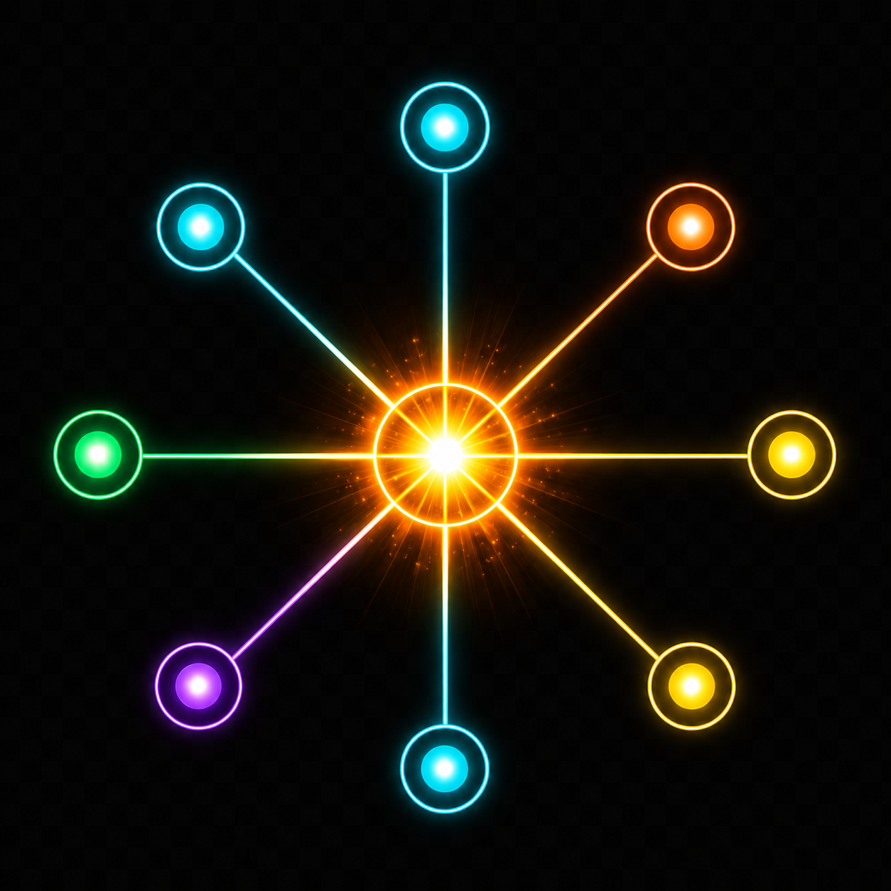

# SHACK-SERVER

<p align="center">
  
</p>

<h3 align="center">
Collect. Fuse. Prioritize.
</h3>

<p align="center">
Open-source platform for intelligent amateur radio information processing.
</p>

---

## Why SHACK-SERVER?

Modern amateur radio operators receive information from many independent systems.

- DX Clusters
- DX Summit
- SOTAWatch
- POTA
- Reverse Beacon Network
- PSK Reporter
- Radio CAT interfaces
- WWV / WCY
- Logbooks

Each system provides only a fragment of the complete picture.

SHACK-SERVER transforms fragmented information into a unified, explainable knowledge model that helps operators make better decisions in real time.

> **SHACK-SERVER is not another DX Cluster.**
>
> It is an **Amateur Radio Intelligence Platform.**

SHACK-SERVER runs on a raspberry Pi 4 with 1GB Ram or higher. Transceivers and SDR are directly connected to the raspberry PI.
Access to the PI is achieved using http witin the lan or https over the wan. On the router you need to open just 1 port: 443. 
As an alternative you can secure the https using cloudflare.


## Super Easy to use Contest Console


## Remote Control for Yaesu (including audio: Mic and Speaker) and CTR2-MIDI Integration Spectrum and Waterfall plus Remote Control over https !


## Fully blown internal SDR (SDR Receiver needed of Course)


# Architecture

```text
                               SHACK-SERVER Architecture

                           Data Sources
                                 │
      ┌──────────────────────────┼──────────────────────────┐
      │                          │                          │
   DX Clusters              Radio Interface          External Services
      │                          │                          │
 HB9ON / HB9IAC              Yaesu / Icom          SOTA / POTA / RBN
 DX Summit                   Kenwood  /SDR                  |
      └──────────────────────────┼──────────────────────────┘
                                 │
                           Collectors
                                 │
                                 ▼
                          Message Classifier
                                 │
                                 ▼
                            Spot Parser
                                 │
                                 ▼
                           Incoming Spot
                                 │
                                 ▼
                           Fusion Engine
      ┌────────────────────────────────────────────────────────────┐
      │                                                            │
      │  • Duplicate Detection                                     │
      │  • Source Correlation                                      │
      │  • Context Enrichment                                      │
      │  • Distance Calculation                                    │
      │  • Bearing Calculation                                     │
      │  • Confidence Score                                        │
      └────────────────────────────────────────────────────────────┘
                                 │
                                 ▼
                            Master Spot
                                 │
                                 ▼
                            Rule Engine
      ┌────────────────────────────────────────────────────────────┐
      │                                                            │
      │  • Relevance Calculation                                   │
      │  • Operator Preferences                                    │
      │  • Explainable Decisions                                   │
      └────────────────────────────────────────────────────────────┘
                                 │
                                 ▼
                             Output Layer
                 ┌──────────────┼──────────────┬──────────────┐
                 ▼              ▼              ▼              ▼
            Dashboard      Telnet Server    REST API     WebSocket


